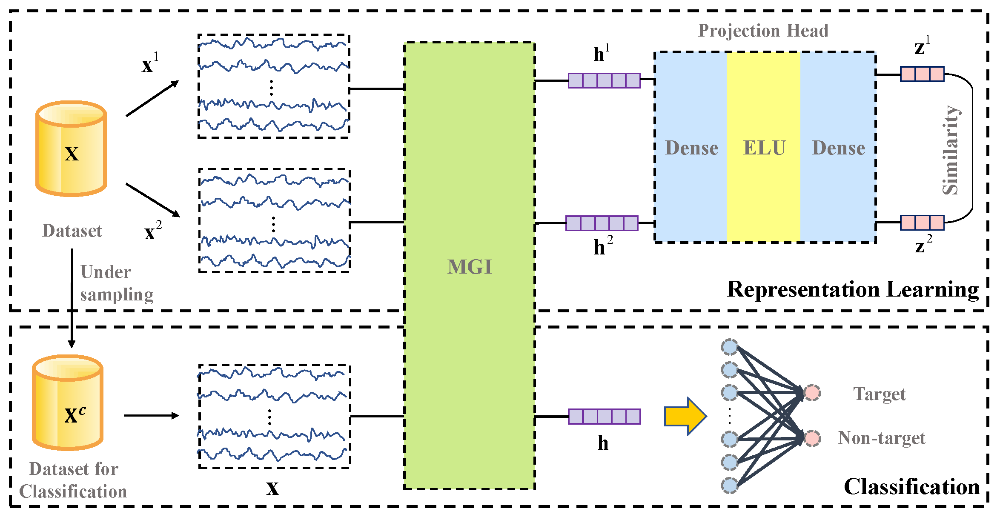

## Introduction

This is the implementation for [Decoupling Representation Learning for Imbalanced Electroencephalography Classification in Rapid Serial Visual Presentation Task](https://iopscience.iop.org/article/10.1088/1741-2552/ac6a7d/meta) in [Journal of Neural Engineering](https://iopscience.iop.org/journal/1741-2552).



## License

This project is released under the [Apache 2.0 license](https://github.com/daodaofr/AlignPS/blob/master/LICENSE).

## Paradigm


## Installation

```txt
python >= 3.6
torch >= 1.7.0
numpy >= 1.20
tqdm >= 4.59.0
scipy >= 1.6.2
```

## Usage

1. modified the config file

   ```json
   {
       "dataset":  
       {
           "name": "Public",  
           "subject_num": 1,
           "pairNum": 20000,
           "channel": 64
       },
       "train_para":
       {
           "batchsize_stage_1" : 1024,
           "batchsize_stage_2" : 128,
           "epoch_stage_1" : 60,
           "epoch_stage_2" : 20
       },
       "model_para":
       {
           "F1": 8, 
           "F2": 2,
           "D": 1,
           "kernel_size": 3,
           "droup_out": 0.6
       }
   }

   ```
2. Train model

   ```cmd
   python main.py
   ```

## Citation

If you use this toolbox or benchmark in your research, please cite this project.
   ```bib
   @article{Li_2022,
   doi = {10.1088/1741-2552/ac6a7d},
   url = {https://doi.org/10.1088/1741-2552/ac6a7d},
   year = 2022,
   month = {may},
   publisher = {{IOP} Publishing},
   volume = {19},
   number = {3},
   pages = {036011},
   author = {Fu Li and Hongxin Li and Yang Li and Hao Wu and Boxun Fu and Youshuo Ji and Chong Wang and Guangming Shi},
   title = {Decoupling representation learning for imbalanced electroencephalography classification in rapid serial visual presentation task},
   journal = {Journal of Neural Engineering}}
   ```
